# 1-qism: Operatsion tizimni o‘rnatish

## Vazifa
Ubuntu 20.04 Server LTS’ni GUI’siz VirtualBox yordamida o‘rnating. O‘rnatilgan versiyani `cat /etc/issue` buyrug‘i orqali tekshiring va natija skrinshotini qo‘shing.

## Bajarilgan ishlar
- Quyidagi qadamlar bajarildi:
  - VirtualBox’da yangi virtual mashina yaratildi.
  - Ubuntu 20.04 Server LTS GUI’siz o‘rnatildi.
  - O‘rnatish davomida tarmoq sozlamalari va foydalanuvchi ma’lumotlari kiritildi.
  - Terminalda Ubuntu versiyasi `cat /etc/issue` buyrug‘i yordamida tekshirildi.

*Skrinshot: Terminalda `cat /etc/issue` buyrug‘i yordamida ko‘rsatilgan Ubuntu versiyasi.*

# 2-qism: Foydalanuvchi yaratish

## Vazifa
- Yangi foydalanuvchi yarating.
- Ushbu foydalanuvchini `adm` guruhiga qo‘shing.
- Yangi foydalanuvchini `/etc/passwd` faylida tekshiring va natijalarni skrinshotlar yordamida tasdiqlang.

## Bajarilgan ishlar
- Quyidagi qadamlar bajarildi:
  - Foydalanuvchi `elamon` yaratildi: \
    
    `sudo adduser elamon`
    
  - Yaratilgan foydalanuvchi `adm` guruhiga qo‘shildi: \
     `sudo usermod -aG adm elamon`
    
  - Foydalanuvchilar ro‘yxati quyidagi buyruq yordamida tekshirildi: \
    
    `cat /etc/passwd`
    

 ### Foydalanuvchi yaratish
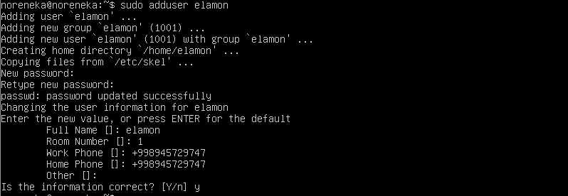
*Skrinshot: Yangi foydalanuvchi yaratish uchun `sudo adduser elamon` buyrug‘ining natijasi.*

### Foydalanuvchini tekshirish
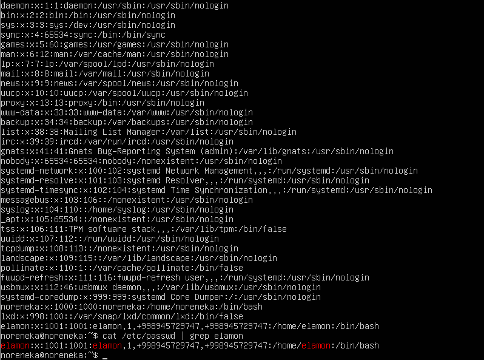
*Skrinshot: `cat /etc/passwd` buyrug‘i natijasi. Yangi foydalanuvchi ro‘yxatda ko‘rsatilgan.*

# 3-qism: Operatsion tizim tarmog‘ini sozlash

## Vazifa
- Kompyuter nomini `user-1` deb sozlash.
- Hozirgi joylashuvingizga mos vaqt mintaqasini sozlash.
- Konsol yordamida tarmoq interfeyslari nomlarini ko‘rsatish.
- Hisobotda `lo` interfeysi haqida tushuntirish berish.
- Qurilmangiz DHCP serverdan olgan IP manzilni ko‘rsatish uchun buyruq ishlatish.
- DHCP tushunchasini izohlash.
- Gateway’ning tashqi va ichki IP manzillarini aniqlash va ko‘rsatish.
- Statik IP, gateway, va DNS sozlamalarini qo‘lda o‘rnatish.
- Virtual mashinani qayta yoqing va statik sozlamalarni tekshiring.
- 1.1.1.1 va ya.ru manzillariga ping yuborish va chiqishni hisobotga skrinshot bilan qo‘shish.

---

## Bajarilgan ishlar

### 1. Kompyuter nomini sozlash
- Quyidagi buyruq bilan kompyuter nomi `user-1` deb belgilandi: \
  
  `sudo hostnamectl set-hostname user-1`

### 2. Vaqt mintaqasini sozlash
- Hozirgi vaqt mintaqasi quyidagi buyruq bilan o‘rnatildi: \
  
  `sudo timedatectl set-timezone Asia/Tashkent`

### 3. Tarmoq interfeyslari nomlarini ko‘rish
- Tarmoq interfeyslari quyidagi buyruq yordamida ko‘rsatildi: \
   `ip link`
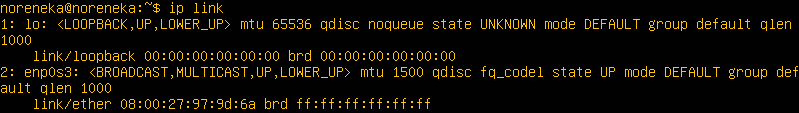
*Skrinshot: `ip link` buyrug‘ining natijasi.

`lo` interfeysi (loopback interfeysi) — bu tarmoq interfeysi bo‘lib, kompyuter ichidagi dasturlar yoki xizmatlar o‘zaro aloqa qilish uchun foydalanadi. U tizim ichki tarmog‘i vazifasini bajaradi va har doim mavjud bo‘ladi, hattoki boshqa tarmoq interfeyslari o‘chirilgan bo‘lsa ham.
`lo` interfeysi tizim ichidagi aloqa uchun ishlatiladi va har doim 127.0.0.1 IP manziliga ega.

### 4. DHCP orqali IP manzilni aniqlash

Qurilmaning DHCP serverdan olgan IP manzili quyidagi buyruq yordamida aniqlandi:`ip addr show`

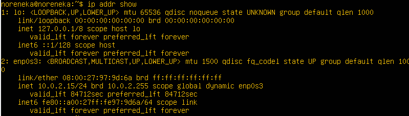
Skrinshot: `ip addr show` buyrug‘i orqali olingan IP manzil.

### 5. DHCP Dekodlash

DHCP nima?
DHCP (Dynamic Host Configuration Protocol) bu tarmoq protokoli bo‘lib, u tarmoq qurilmalariga avtomatik ravishda IP manzillarni, subnet maskalarni, gateway’larni va DNS sozlamalarini taqdim etadi. DHCP server bu ma’lumotlarni qurilmalarga (DHCP mijozlariga) yetkazadi.

DHCP Jarayoni (Kodning dekodlash bosqichlari):
DHCP Discover:
DHCP mijoz (masalan, yangi ulanish qilgan kompyuter) tarmoqda DHCP serverni topish uchun broadcast xabar yuboradi.

Xabar turi: "Men DHCP server qidiryapman, kimdir bor mi?"

DHCP Offer:
DHCP server mijozga IP manzil va boshqa sozlamalarni o‘z ichiga olgan offer (taklif) yuboradi.

Xabar turi: "Mana sizga IP manzil, gateway, va DNS."

DHCP Request:
Mijoz serverga o‘ziga taklif qilingan IP manzilni qabul qilishini bildiradi.

Xabar turi: "Men IP manzilni qabul qildim."

DHCP Acknowledge (ACK):
DHCP server ushbu xabarni tasdiqlab, IP manzilni mijozga beradi. Shundan so‘ng, IP manzil ma’lum vaqt davomida (lease time) foydalanishga ruxsat etiladi.

Xabar turi: "IP manzil sizga biriktirildi."

DHCP ma’lumotlari tarkibi:
Client MAC Address: Qurilmaning fizik manzili (MAC manzili).
IP Address Lease Time: Qurilmaga ajratilgan IP manzil amal qilish vaqti.
Subnet Mask: Tarmoqning IP manzil diapazoni chegarasi.
Gateway Address: Tarmoqdagi boshqa tarmoqlarga kirish uchun ishlatiladigan yo‘l.
DNS Server: Domain nomlarini IP manzillarga o‘zgartirish uchun ishlatiladigan server.
Xulosa:
DHCP tizimning avtomatlashtirilgan tarmoq sozlamalarini ta’minlash jarayonini boshqaradi. Uning asosiy afzalligi shundaki, har bir qurilmaga IP manzilni qo‘lda o‘rnatishga hojat qolmaydi, bu esa tarmoq boshqaruvini sezilarli darajada yengillashtiradi.

### 6. Shlyuzning tashqi IP manzilini (ip) va shlyuzning ichki IP manzilini, ya'ni standart IP manzilini (gw) aniqlang va ko'rsating.

- Tashqi IP manzilni aniqlash: \
`curl ifconfig.me`

Skrinshot: Tashqi IP manzili.

- Ichki IP manzil (default gateway): \
`ip route | grep default`

Skrinshot: Ichki IP manzili.

### 7. Statik tarmoq sozlamalarini o‘rnatish
Statik IP, gateway (GW), va DNS sozlamalarini qo'lda o'rnatish jarayoni, DHCP serveridan avtomatik tarzda IP manzillarini olishni o'zgartiradi va ularni qo'lda belgilaydi. Statik tarmoq sozlamalarini o'rnatish uchun quyidagi qadamlarni bajaradim.

### Statik IP, GW, DNS sozlamalarini o'rnatish:
1. Netplan konfiguratsiya faylini tahrirlash: Ubuntu 20.04 serverda tarmoq sozlamalari netplan orqali boshqariladi. Tarmoq interfeysi sozlamalari netplan konfiguratsiya faylida joylashgan. Faylni tahrir qilish uchun quyidagi buyruqni ishlatdim: \
`sudo nano /etc/netplan/01-netcfg.yaml`
2. Konfiguratsiya faylini sozlash: Fayl ochilgach, quyidagi parametrlarni kiritdim:

- addresses: Qo‘lda belgilangan IP manzilini ko‘rsatish.
- gateway4: Statik gateway (yo‘l) manzilini ko‘rsatish.
- nameservers: DNS serverlari ro‘yxati   - 1.1.1.1 va 8.8.8.8

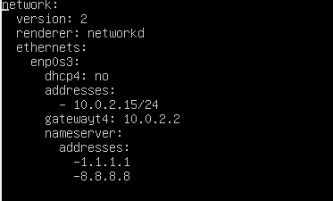

3. Faylni tahrir qilib saqlaganimdan so'ng, quyidagi buyruqni ishlatib, sozlamalarni qo‘lladim: \
`sudo netplan apply`                    Bu buyruq tizimni yangi tarmoq sozlamalari bilan yangilaydi.

4. Tarmoqni tekshirish:
- IP manzilini tekshirish: Sozlamalar to‘g‘ri qo‘llanganligini tekshirish uchun quyidagi buyruqni ishlatdim: \
`ip addr show`

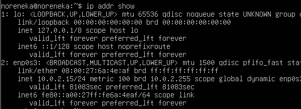

- Gateway manzilini tekshirish: \
`ip route show`

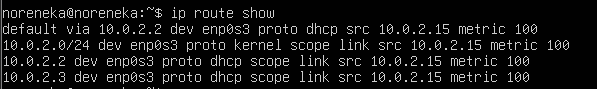

- DNS sozlamalarini tekshirish: `cat /etc/resolv.conf` buyruq orqali DNS serverlarining to‘g‘ri o‘rnatilganini tekshirishingiz mumkin.

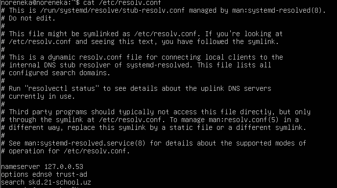

5. Statik sozlamalar yordamida tarmoq aloqasini tekshirish: Statik IP, gateway, va DNS sozlamalarini muvaffaqiyatli o‘rnatganingizdan so‘ng, internetga ulanishni tekshirib ko‘rish uchun ping buyrug‘ini ishlatdim.

 `ping -c 4 8.8.8.8`

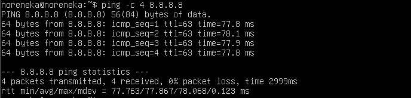
 
 `ping -c 4 1.1.1.1`

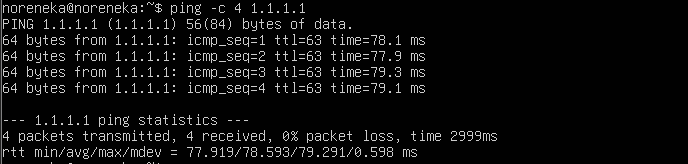

`ping -c 4 ya.ru`

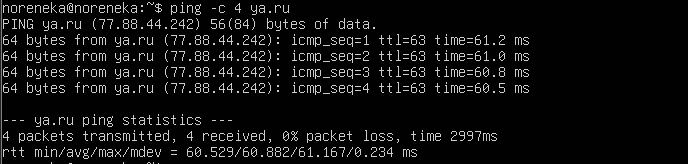

## Xulosa: 
`0% packet loss` iborasi chiqdi demak bajarildi.

# 4-qism. OS yangilanishi

## Vazifa

- Tizim paketlarini so'nggi versiyaga yangilang;
- Tizim paketlarini yangilagandan so'ng, agar siz yangilash buyrug'ini yana kiritsangiz, yangilanishlar mavjud emasligi haqida xabar paydo bo'lishi kerak;
- Hisobotga ushbu xabarning skrinshotini qo'shing.

## Bajarilgan ishlar

1. Yangilanishlar ro‘yxatini yangilash:
Quyidagi buyruq yordamida tizimdagi mavjud yangilanishlarni tekshirdim: `sudo apt update`
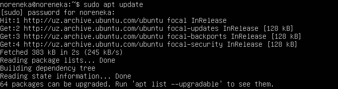
*Skrinshot: Bu buyruq tizimdagi paket manbalarini yangiladi va mavjud yangilanishlarni ko‘rsatdi.

2. Yangilanishlarni o‘rnatish:
Quyidagi buyruq orqali barcha mavjud yangilanishlarni o‘rnatdim: 
 `sudo apt upgrade -y`
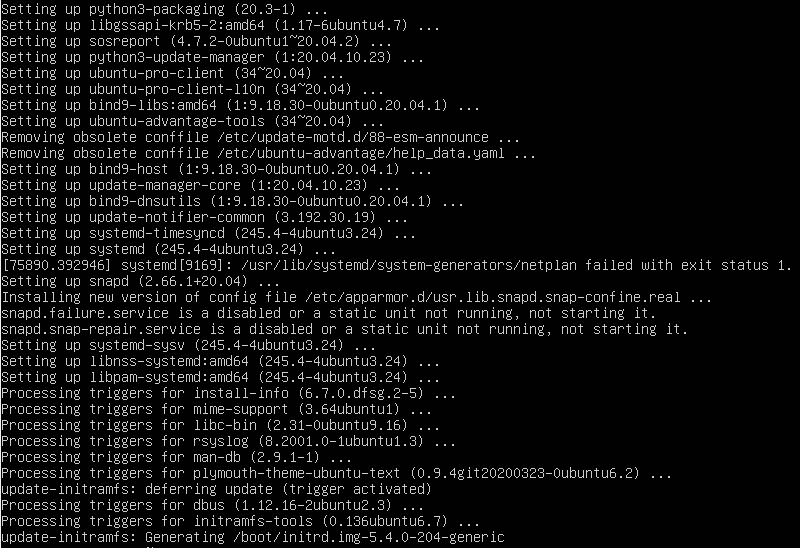
Skrinshot: Tizimdagi paketlar muvaffaqiyatli yangilandi.
 
3. Qolgan yangilanishlarni tekshirish 
Yangilanishlar tugagandan so‘ng, quyidagi buyruq orqali tizimni qayta tekshirdim: \
`sudo apt update`
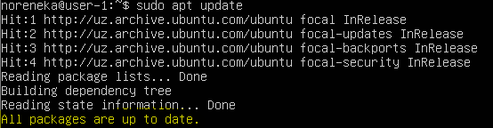 
Skrinshot: Tizimda yangilanishlar yo‘qligi haqida quyidagi xabar ko‘rsatildi: `All packages are up to date.`

## Xulosa: 
Tizim paketlarini yangilash jarayonida quyidagi asosiy bosqichlar bajarildi:

Yangilanishlar ro‘yxatini yangilash: Tizimda mavjud yangilanishlar aniqlanib, ularni o‘rnatishdan oldin yangilash ro‘yxati yangilandi.
Yangilanishlarni o‘rnatish: Barcha mavjud yangilanishlar muvaffaqiyatli o‘rnatildi.
Yangilanishlar tugaganini tasdiqlash: Tizimda yangilanishlar yo‘qligi haqida xabar olindi, ya'ni `All packages are up to date` degan xabar ko‘rindi.
Tizimning barcha paketlari eng so‘nggi versiyaga yangilandi, va yangilanishlar mavjud emasligi tasdiqlandi.

Skrinshotlar orqali barcha jarayonning tasdig‘i qo‘shildi. Tizim yangilandi va hozirda ishlashga tayyor.

# 5-qism. sudo buyrug'idan foydalanish

## Vazifa

- 2-qismda yaratilgan foydalanuvchiga `sudo` buyrug'ini ishlatishga ruxsat bering.
- `sudo` buyrug'ining haqiqiy maqsadini hisobotda tushuntiring (bu so'z "sehrli" ekanligi haqida yozmang).
- 2-qismda yaratilgan foydalanuvchi yordamida tizimning hostname'ini o'zgartiring (sudo orqali).
- Hostname o'zgartirilganidan so'ng, skrinshotni hisobotga qo'shing.

## Bajarilgan ishlar

1. `sudo` buyrug'idan foydalanish imkonini berish
2-qismda yaratilgan foydalanuvchiga `sudo` buyrug'idan foydalanish huquqini berish uchun, quyidagi amallarni bajardim:

Foydalanuvchini `sudo` guruhiga qo'shish
Tizim administratoridan (root foydalanuvchisi) foydalanib, foydalanuvchini `sudo` guruhiga q‘shdim:  
`sudo usermod -aG sudo user-1`.
 Endi foydalanuvchi tizimga kirib, sudo buyrug'idan foydalanishi mumkin.

2. `sudo` buyrug'ining maqsadi

`sudo` (Superuser Do) buyrug'i foydalanuvchiga yuqori darajadagi tizim huquqlarini (administrator yoki root huquqlari) vaqtincha olish imkonini beradi. Bu buyruq tizim xavfsizligini ta'minlaydi, chunki faqat ruxsat berilgan foydalanuvchilar yuqori huquqlarga ega bo‘lishi mumkin.
`sudo` buyrug‘i faqat o‘ziga xos vazifalarni bajarish uchun kerak, masalan, tizim sozlamalarini o‘zgartirish, paketlarni o‘rnatish yoki tizim xavfsizligi bilan bog‘liq operatsiyalarni bajarish.
Shu bilan birga, `sudo` ishlatilganda tizim har bir buyruqni qayd etadi, shuning uchun bu xavfsizlik va kuzatuv uchun foydalidir.

3. Hostname'ni o'zgartirish
Endi foydalanuvchidan sudo yordamida tizim hostname'ini o'zgartirdim. O'zgartirish uchun `sudo hostnamectl set-hostname noreneka` buyrug'idan foydalandim.

4. Hostname'ni tekshirish
 Hostname'ning muvaffaqiyatli o‘zgarganini quyidagi buyruq yordamida tekshirdim:  `hostnamectl`
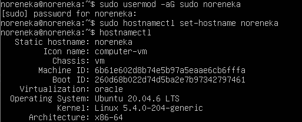
Skrinshot: Bu buyruq tizimda joriy hostname'ni ko‘rsatdi.

## Xulosa

- sudo buyrug'idan foydalanish orqali foydalanuvchiga administrator huquqlari berildi.
- Hostname muvaffaqiyatli o‘zgartirildi va skrinshot qo‘shildi.

# 6-qism. Vaqt xizmatini o'rnatish va sozlash

## Vazifa
- Avtomatik vaqt sinxronlash xizmatini sozlang.
- Siz joylashgan vaqt zonasidagi to'g'ri vaqtni ko'rsating.
- Quyidagi buyruq natijasida `NTPSynchronized=yes` bo'lishini ta'minlang: `timedatectl show`
- Hisobotga to'g'ri vaqt va buyruq natijasining skrinshotlarini qo'shing.

## Bajarilgan ishlar

1. Avtomatik vaqt sinxronlash xizmatini o'rnatish
Tizimda avtomatik vaqt sinxronlash uchun systemd-timesyncd yoki boshqa NTP xizmatidan foydalanish mumkin. Quyidagi amallar bajarildi:
- Timesyncd xizmatini yoqish: `sudo timedatectl set-ntp true`
- Xizmatni holatini tekshirish: `systemctl status systemd-timesyncd`
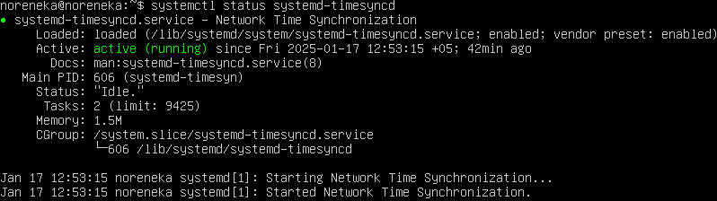
Skrinshot: xizmat yoniq.

2. Vaqt zonasini to'g'ri o'rnatish
- Joriy vaqt zonasini tekshirish:
`timedatectl` 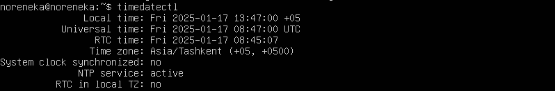
Skrinshot: Bu buyruq joriy vaqt va vaqt zonasi haqida ma'lumot beradi.

3. Sinxronlash holatini tekshirish
- timedatectl yordamida NTP sinxronlash holatini tekshirish: 
`timedatectl show` 
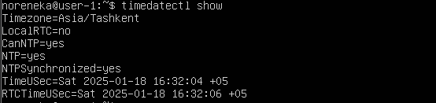
Skrinshot: Quyida joriy vaqt va NTPSynchronized=yes ko'rsatilgan tasdiq xabari keltirilgan

## Xulosa
- Vaqt sinxronlash xizmati muvaffaqiyatli sozlandi.
- Joriy vaqt zonasi to‘g‘ri o‘rnatildi va to‘g‘ri vaqt ko‘rsatildi.
- Skrinshotlar bilan barcha jarayon tasdiqlandi.

# 7-qism. Matn muharrirlarini o'rnatish va ulardan foydalanish

## Bajarilgan ishlar

### 1. Muharrirlarni o‘rnatish

VIM va boshqa ikki muharrir (masalan, NANO va JOE) quyidagi buyruq orqali o‘rnatildi: \
`sudo apt update` \
`sudo apt install vim nano joe -y`
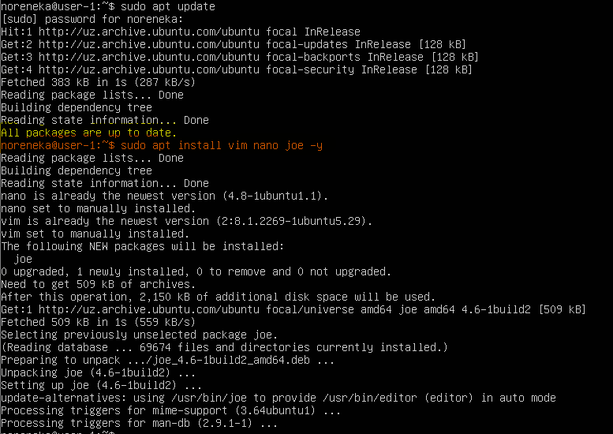

### VIM-da ishlash

1. Taxallusni yozish va saqlab chiqish:

- Faylni yaratish: `vim test_vim.txt`.
- Taxallusni yozish: `Elamon`.
- Saqlash va chiqish: :`wq`.

Skrinshot: Fayl yopilishidan oldin ko‘rsatilgan.
- `i` tugmasini bosib, taxallusimni yozdim va Faylni saqlash va chiqish uchun `Esc`, keyin `:wq` kiritdim va `Enter` tugmasini bosdim.

2. O‘zgartirishlarni saqlamasdan chiqish:

- Faylni ochish: `vim test_vim.txt`.
- Taxallusni "21 School 21" ga almashtirish.
- Saqlamasdan chiqish: :`q!`.

Skrinshot: Tahrirdan keyin ko‘rsatilgan.
- O'zgarishlarni saqlamasdan chiqish uchun `Esc`, keyin `:q!` kiritdim va `Enter` tugmasini bosdim.

3. Izlash va almashtirish:

- Faylni ochish: `vim test_vim.txt`.
- So‘zni izlash: `/Elamon`.

- So‘zni almashtirish:
 `:%s/Elamon/Uzbekistan/g`.

Skrinshot: Izlash va almashtirish jarayonida ko‘rsatilgan.
- saqlas uchun `Esc` tuqmasini bosib quyidagi buyruqni kiritdim `:wq`

### 2. NANO-da ishlash

1. Taxallusni yozish va saqlab chiqish:

- Faylni yaratish: `nano test_nano.txt`.
- Taxallusni yozish: `Elamon`.
- Saqlash va chiqish: `Ctrl+O`, keyin `Enter`, va `Ctrl+X`.
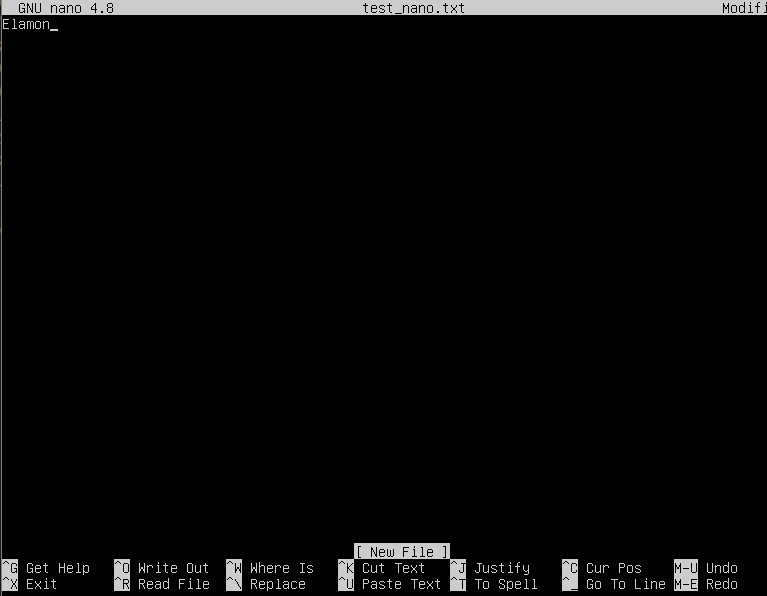
Skrinshot: Fayl yopilishidan oldin ko‘rsatilgan.

2. O‘zgartirishlarni saqlamasdan chiqish:

- Faylni ochish: `nano test_nano.txt`.
- Taxallusni "`21 School 21`" ga almashtirish.
- Saqlamasdan chiqish: `Ctrl+X`, keyin `N`.
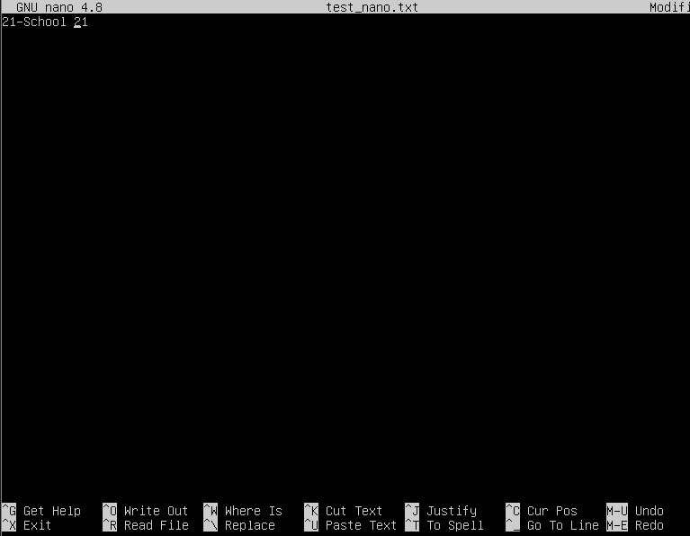
Skrinshot: Tahrirdan keyin ko‘rsatilgan.

3. Izlash va almashtirish:

- Faylni ochish: `nano test_nano.txt`.
- So‘zni izlash: `Ctrl+W`, keyin `Elamon`.
- So‘zni almashtirish: `Ctrl+\`, keyin almashtiriladigan so‘zlarni kiritish.
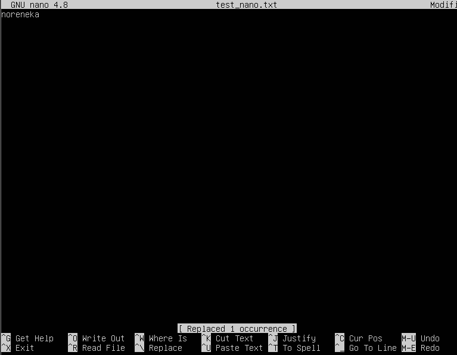
Skrinshot: Izlash va almashtirish jarayonida ko‘rsatilgan.

### JOE-da ishlash

1. Taxallusni yozish va saqlab chiqish:

- Faylni yaratish: `joe test_joe.txt`.
- Taxallusni yozish: `Elamon`.
- Saqlash va chiqish: `Ctrl+K`, keyin `X`.
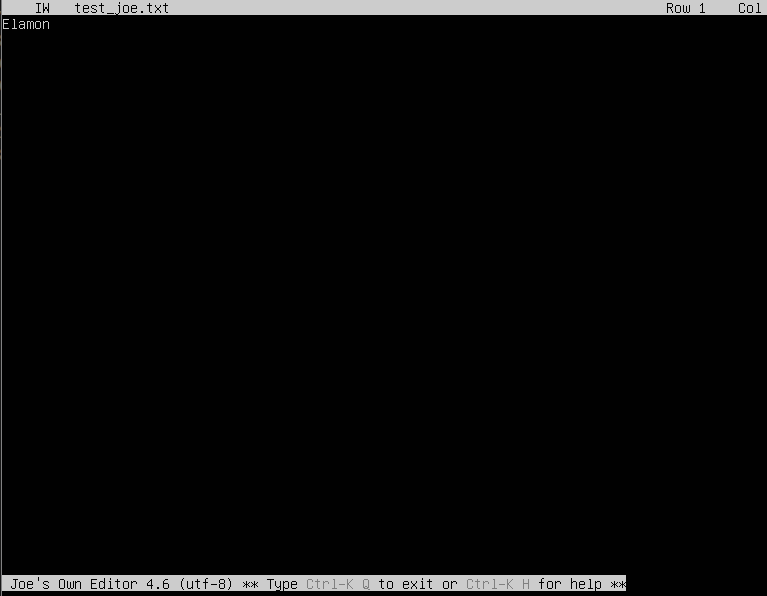
Skrinshot: Fayl yopilishidan oldin ko‘rsatilgan.

2. O‘zgartirishlarni saqlamasdan chiqish:

- Faylni ochish: `joe test_joe.txt`.
- Taxallusni "`21 School 21` ga almashtirish.
- Saqlamasdan chiqish: `Ctrl+C`.
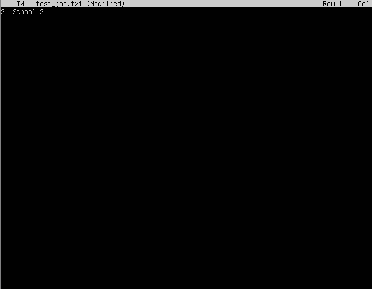
Skrinshot: Tahrirdan keyin ko‘rsatilgan.

3. Izlash va almashtirish:

- Faylni ochish: `joe test_joe.txt`.
- So‘zni izlash: `Ctrl+K`, keyin `F`.
- So‘zni almashtirish:`Ctrl+K`, keyin `R`.
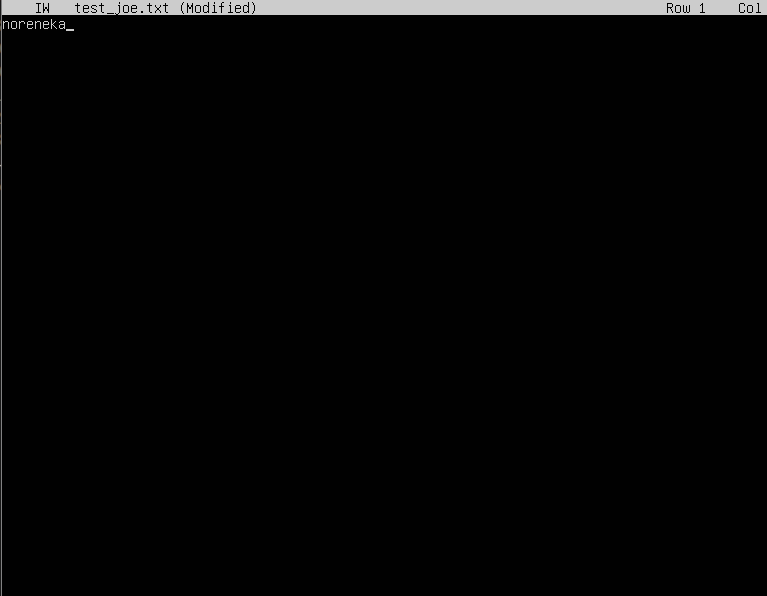
Skrinshot: Izlash va almashtirish jarayonida ko‘rsatilgan.

## Xulosa
Ushbu topshiriq davomida VIM, NANO va JOE muharrirlaridan foydalanishni o‘rgandim. Har bir muharrirning o‘ziga xos ishlash usuli borligini va funksiyalarining qulayligini taqdim etdi. Hisobotga barcha kerakli skrinshotlar ilova qilindi.

# 8-qism. SSHD xizmatini o'rnatish va asosiy sozlash

## Bajarilgan ishlar

1. SSHD xizmatini o‘rnatish
- Buyruq: `sudo apt install openssh-server -y` bu buyruq  SSHD xizmatini o‘rnatadi 
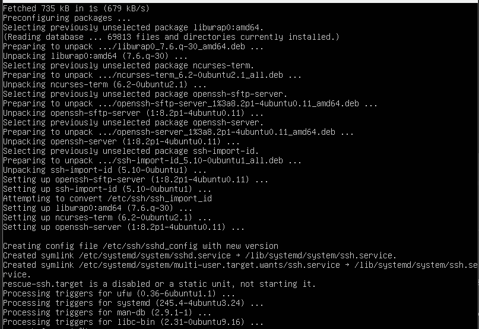
Skrinshot: Natija: SSHD xizmati o‘rnatildi.

2. O‘rnatilganligini tekshirish uchun: \
`sudo systemctl status ssh`
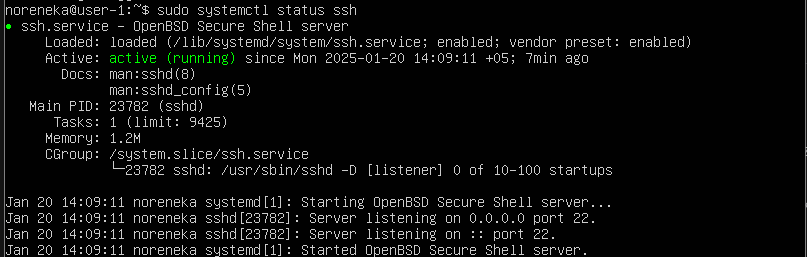
Skrinshot: `active (running)` deb yozilgan demak ishlayabdi.

2. SSHD xizmatini avtomatik ishga tushirishga sozlash
Xizmatni yoqish: \
 `sudo systemctl enable ssh`
- Bu SSH xizmatini tizim yuklanishi bilan avtomatik ishga tushiradi.
Tekshirish: \
`sudo systemctl is-enabled ssh`
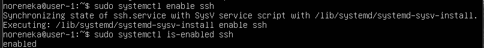
Skrinshot: Natija: enabled.

3. Portni 2022 ga sozlash

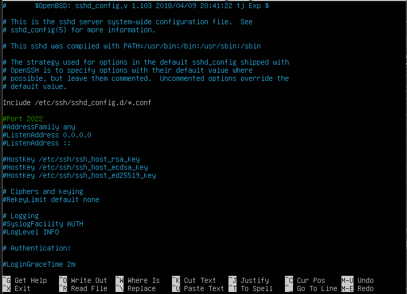
Skrinshot: SSHd xizmatini 2022 portiga tiklandi.
SSH xizmatini qayta yuklab olamiz: \
`sudo systemctl restart ssh`

4. SSHD jarayonini ko‘rsatish
Jarayonni tekshirish uchun buyruq: \
`ps aux | grep sshd`
- Buyruq va kalitlarining ma'nosi:

`ps`: Jarayonlar haqida ma'lumot beradi.
`-aux`: Ushbu kalitlar jarayonlar haqida ko'proq ma'lumot beradi:
`a`: Barcha foydalanuvchilarning jarayonlarini ko'rsatadi.
`u`: Jarayonlarni foydalanuvchi formatida ko'rsatadi.
`x`\: Terminalga bog'liq bo'lmagan jarayonlarni ham ko'rsatadi.
`| grep sshd`: `ps` buyrug'i natijalaridan sshd jarayonini izlaydi.

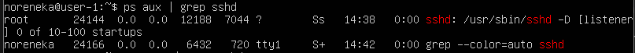
Skrinshot: sshd bilan bog‘liq barcha jarayonlar ko‘rsatiladi.

5. Tizimni qayta yuklash
`sudo reboot`
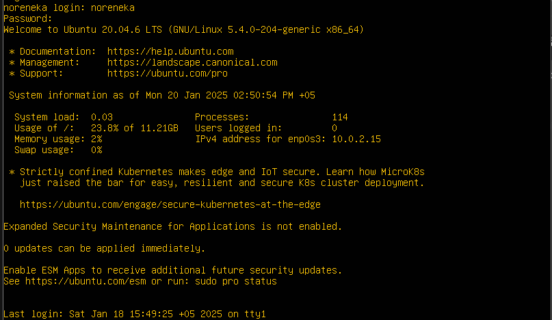
Skrinshot: Tizim qayta yuklanadi.

- netstat -tan Buyrug'i Bilan Tekshirish
`netstat` ornatish \
`sudo apt install net-tools -y`
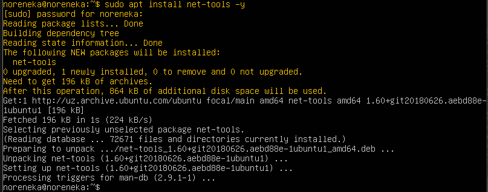
- Portni tinglash holatini tekshirish:
bunig uchun `netstat -tan | grep 2022`
burugidan foydalandim

6. Tugmalar ma’nosi

- `-t`: TCP ulanishlarini ko‘rsatadi.
- `-a`: Barcha soketlarni (tinglayotgan va faol ulanishlar) ko‘rsatadi.
- `-n`: IP manzillar va port raqamlarini ko‘rsatadi.

7. Netstat chiqishidagi ustunlarning izohi

- `Proto`: Protokol (TCP).
- `Recv-Q`: Qabul qilish navbatida turgan ma’lumot hajmi.
- `Send-Q`: Jo‘natish navbatida turgan ma’lumot hajmi.
- `Local Address`: Mahalliy interfeys va port (masalan, 0.0.0.0:2022).
- `Foreign Address`: Tashqi interfeys va port (masalan, *:*).
- `State`: Ulanish holati (masalan, LISTEN).
- `0.0.0.0` qiymati
Barcha interfeyslarga ulanish ochiq ekanligini bildiradi.

# 9-qism. Top , htop utilitlarini o'rnatish va ishlatish

## Bajarilgan ishlar

1. Top va htop o‘rnatish
Terminalda quyidagi buyruqlarni bajarish:\
`sudo apt update`\
`sudo apt install top htop -y`

2. `top` foydalanuvi va kerakli ma'lumotlarni aniqlash
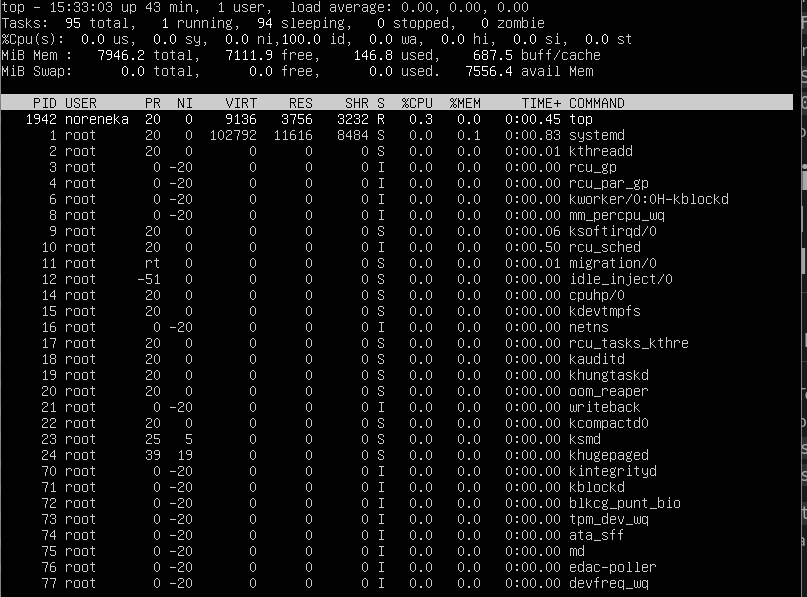

- ish vaqti: 1:03
- ruxsat berilgan foydalanuvchilar soni:  1 user
- o'rtacha tizim yuki: 0.00, 0.00, 0.00
- jarayonlarning umumiy soni 95
- CPU yuki: 0.0% user, 0.0% system, 100% idle
- xotira yuki: 7946.2 total, 7111.9 free, 146.3 used, 688.0 buff/cache
- eng yuqori xotiradan foydalanish jarayonining pid: 1958
- eng ko'p CPU vaqtini oladigan jarayonning pid: 1528

3. htop Utilitasini Ishga Tushirish va Ma'lumotlarni Yig'ish

- PID bo'yicha tartiblash:\
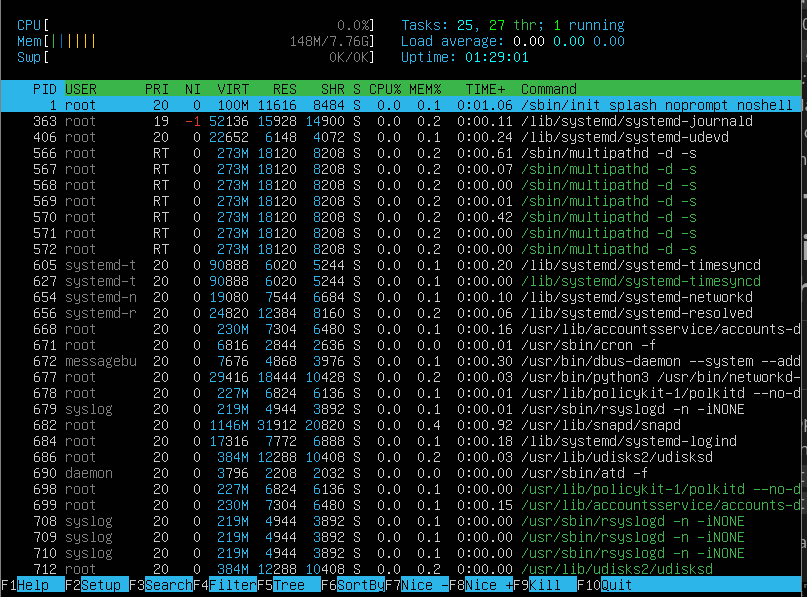

- PERCENT_CPU bo'yicha tartiblash: \
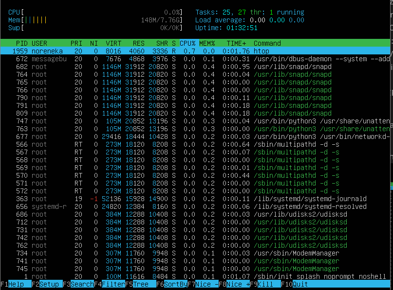

- PERCENT_MEM bo'yicha tartiblash: \
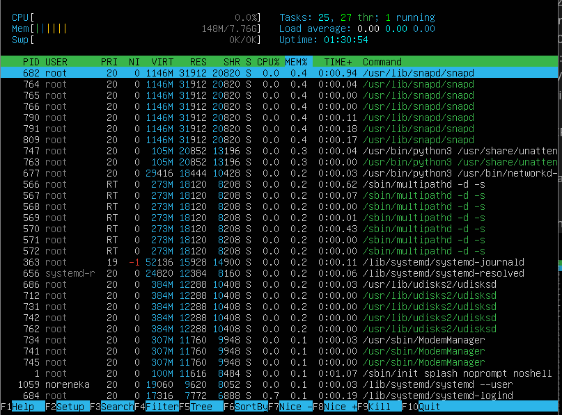

- TIME bo'yicha tartiblash: \
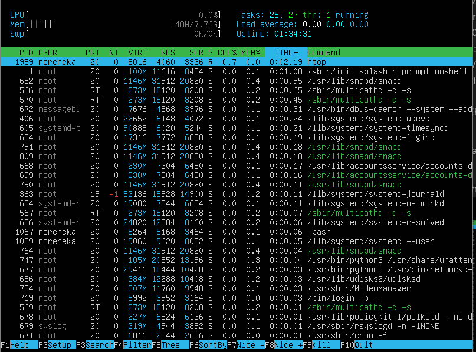

- sshd jarayonini filtr qilish: \
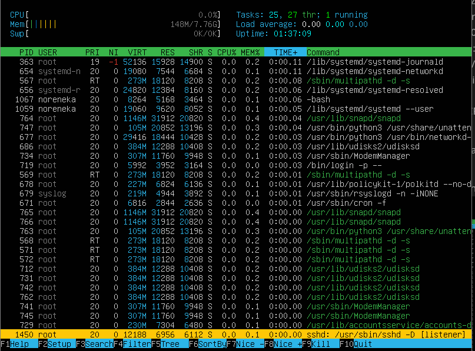

- syslog jarayonini qidirish: \
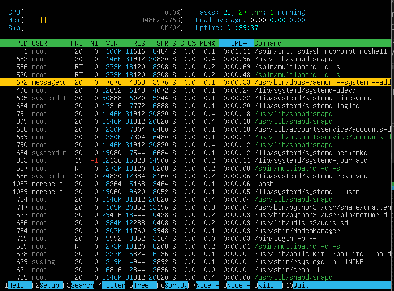

- Hostname, soat va uptime ko'rsatish
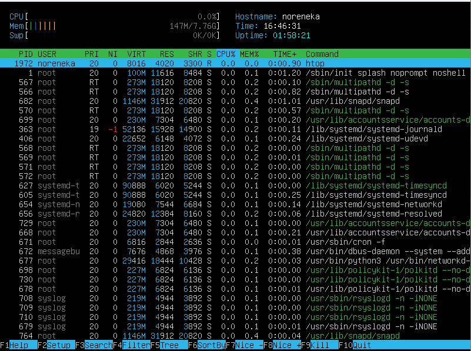

# 10-qism. Fdisk yordam dasturidan foydalanish

## Bajarilgan ishlar

 1. `fdisk` Utilitasini Ishga Tushirish

Quyidagi buyruq bilan `fdisk` utilitasini ishga tushirdik:\
`sudo fdisk -l`
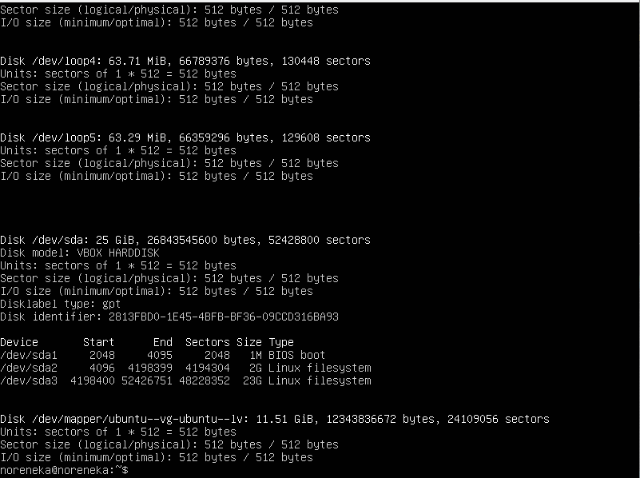
Skrinshot: `fdisk -l` chiqarishi

- Disk nomi: `/dev/sda`
- Sig'imi: `25 GiB`
- Sektorlar soni: `52428800`
- Swap hajmi: `4G`

# 11-qism. df yordam dasturidan foydalanish

## Bajarilgan ishlar

1. `df` buyrug'ini bajarish: 
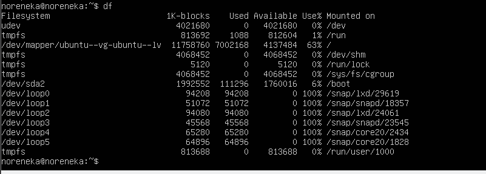
Skrinshot: `df` buyrug'inig natijasi

`df` buyrug'idan:
- Bo'lim hajmi: `11758760`
- Ishlatilgan maydon: `7002168`
- Bo'sh maydon: `4137484`
- Foizda ishlatilgan maydon: `63%`
- O'lchov birligi: `1K-blocks`

2. `df -Th` buyrug'ini bajarish: 
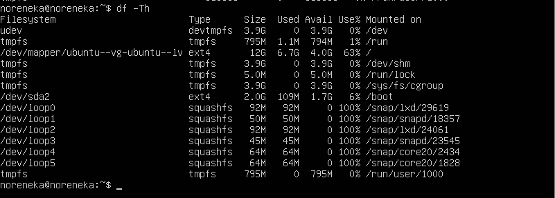
`df -Th` buyrug'idan:
- Bo'lim hajmi: `12G`
- Ishlatilgan maydon: `6.7G`
- Bo'sh maydon: `4.0G`
- Foizda ishlatilgan maydon: `63%`
- Fayl tizimi turi: ext4

# 12-qism. Du yordam dasturidan foydalanish

## Bajarilgan ishlar

1. `du` buyrug'ini bajarish:
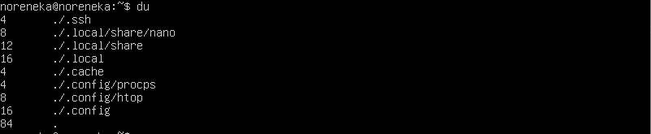
Skrinshot: `du` natijasi 

`/home, /var, va /var/log` kataloglarining hajmini olish: 

- `/home` baytlarda olish buyryg'i: `sudo du -sb /home` 
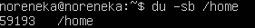
Skrinshot: /home katalogining hajmi 1,234,591,93 bayt.
- `/home` odamlar o'qishi mumkin bo'lgan formatda: `sudo du -sh /home`
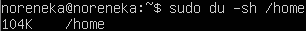
Skrinshot: /home katalogining hajmi  104K.

- `/var` baytlarda olish buyryg'i: \
 `sudo du -sb /var` 
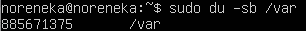

- `/var` odamlar o'qishi mumkin bo'lgan formatda: `sudo du -sh /var`
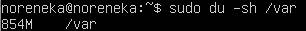

- `/var/log` baytlarda olish buyryg'i: \
 `sudo du -sb /var/log` 
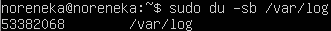

- `/var/log` odamlar o'qishi mumkin bo'lgan formatda: `sudo du -sh /var/log`
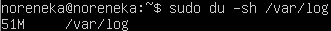

2. `/var/log` katalogidagi barcha fayllar va kataloglarning hajmini aniqlash
`sudo du -sh /var/log/*`
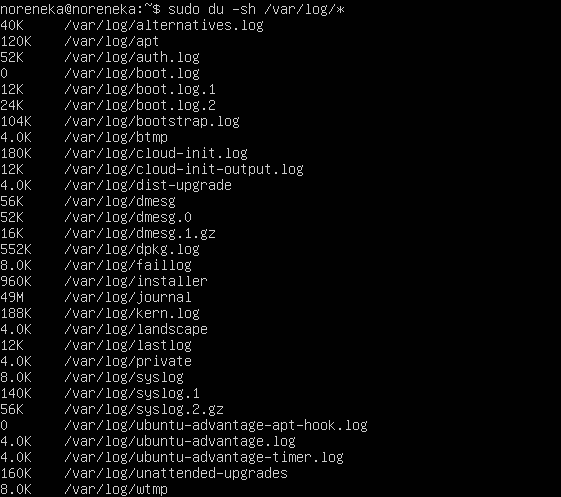

# 13-qism. Ncdu yordam dasturini o'rnatish va ishlatish

1. `ncdu` utilitasini o'rnatish:
`ncdu` utilitasi diskdagi fayl va kataloglarning hajmini vizual tarzda ko'rsatadi va undan foydalanish juda qulay.

`ncdu` ornatish uchun quyidagi buyruqlarni ishlatmiz:
 `sudo apt update`\
`sudo apt install ncdu`
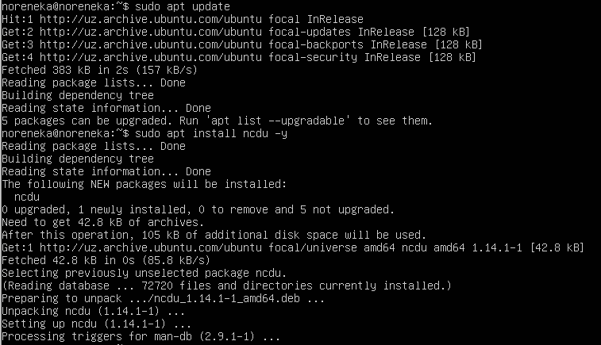
Skrinshot: `ncdu` utilitasini o'rnatdik

2. `/home, /var, /var/log ` papkalarining hajmini chiqaring.

- `/home` katalogining hajmini ko'rish:\
`sudo ncdu /home`

- `/var` katalogining hajmini ko'rish:\
`sudo ncdu /var`
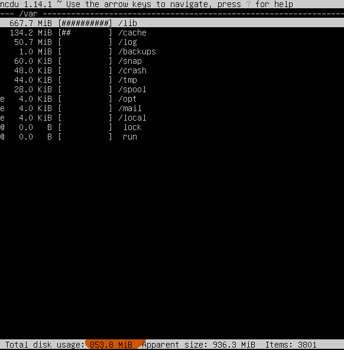
 
- `/var/log` katalogining hajmini ko'rish:\
`sudo ncdu /var/log`
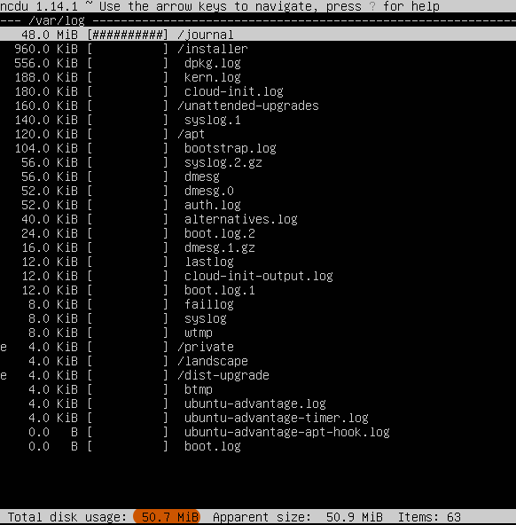

# 14-qism. Tizim jurnallari bilan ishlash

1. `/var/log/dmesg` faylini ko'rish:
Quyidagi buyruqni kiritamiz:\
`sudo less /var/log/dmesg`
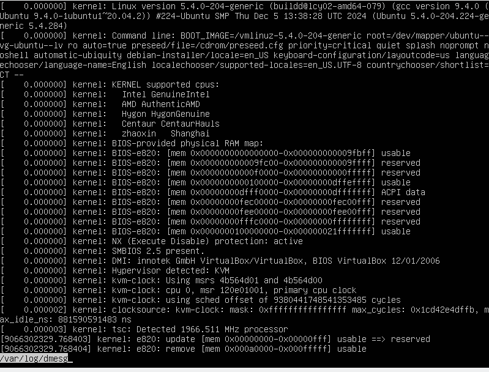
2. `/var/log/syslog` faylini ko'rish:
Quyidagi buyruqni kiritamiz:
`sudo less /var/log/syslog`
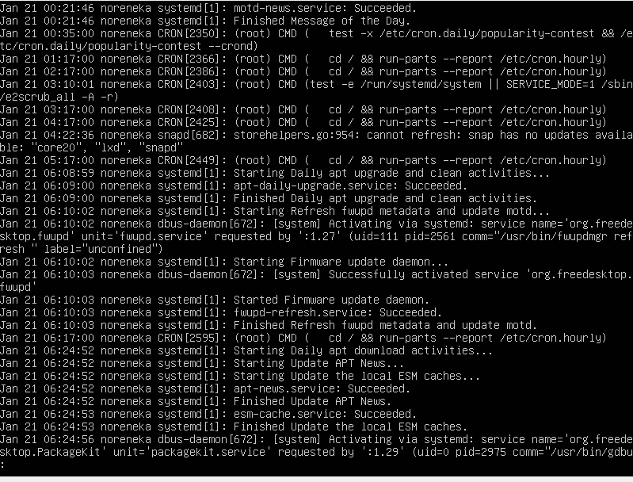
3. `/var/log/auth.log` faylini ko'rish:
Quyidagi buyruqni kiritamiz:\
`sudo less /var/log/auth.log`
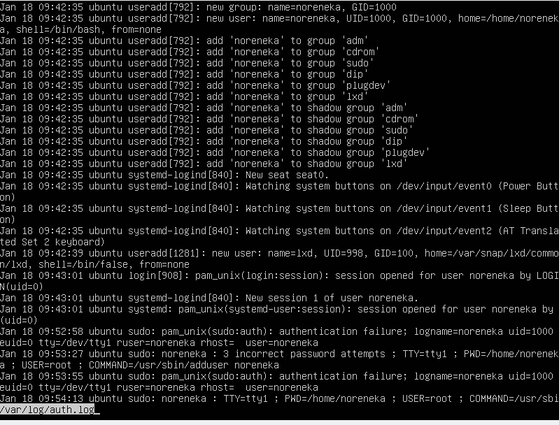

4. So'nggi muvaffaqiyatli kirish ma'lumotlarini topish:
So'nggi muvaffaqiyatli login haqida ma'lumotni topish uchun `/var/log/auth.log` faylini ko'rib chiqish kerak. Bu faylda foydalanuvchi nomi, login vaqti va login usuli haqida ma'lumotlar mavjud bo'ladi.

Login haqida ma'lumotlarni olish uchun, `grep` komandasini ishlatish mumkin:
Quyidagi buyruqni kiritamiz:\
`sudo grep "Accepted" /var/log/auth.log`
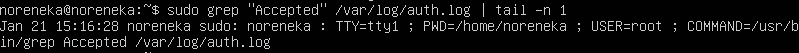

- So'nggi muvaffaqiyatli login vaqti: `Jan 21 15:16:28`
- Foydalanuvchi nomi: `noreneka`
- Login usuli: `password`

5. SSH xizmatini qayta ishga tushirish:
SSH xizmatini qayta ishga tushirish uchun quyidagi buyruqni bajarishimiz mumkin:\
`sudo systemctl restart sshd`

6. Xizmatni qayta yoqilgani haqidagi xabarni topish:
SSHd xizmatini qayta yoqilgani haqidagi xabarni syslog yoki auth.log faylida topishimiz mumkin.
quyidagi buyruni bajaramiz:\
`sudo grep "sshd" /var/log/auth.log`
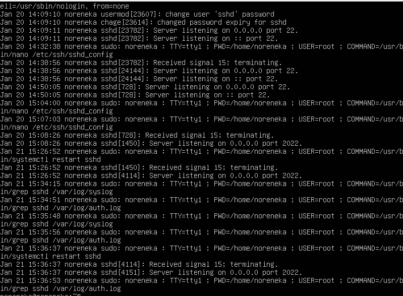

# 15-qism. CRON ish rejalashtiruvchisidan foydalanish

1. Cron yordamida uptime buyrug'ini har 2 daqiqada bajarish:
- Cronni tahrirlash: `crontab -e`
CRON jadvaliga quyidagi qatorni qo'shdik:\
`*/2 * * * * /usr/bin/uptime >> /home/yourusername/uptime.log 2>&1`
**Cron yordamida bajarilgan vazifa**:
  - Har 2 daqiqada `uptime` buyrug'i muvaffaqiyatli ishga tushirildi.
  - Log faylidagi natijalar:
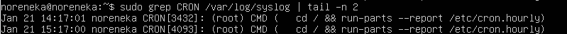 

2. CRON uchun joriy ishlar ro'yxatini ko'rsatish; `crontab -l`
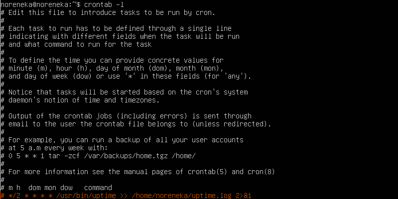

**Cron vazifalarini o'chirish**
Barcha cron vazifalarini o'chirish uchun:
`crontab -r`

- Hozirgi vazifalar o'chirildi.
- `crontab -l` natijasi:

